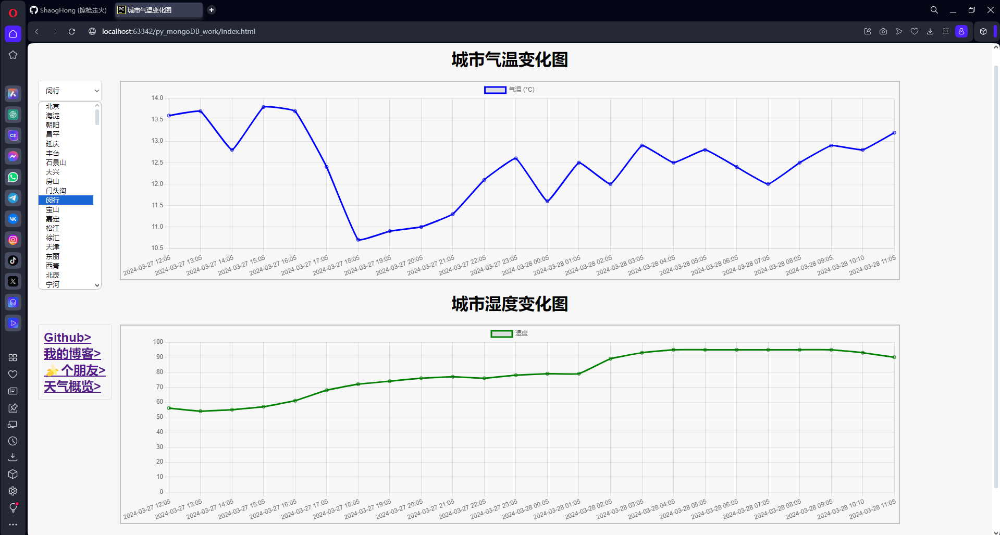

# 炒点python不加SQL
## 王老师的数据采集和可视化作业:Python+MongoDb+chart.js实现各个城市天气情况的可视化并使用html+css在web中展示
**[最终效果图](./all_img/dome—OK.png)✨**

## [绿色安装MongoDB看这篇文章🧐](./mongo从安装到使用.md)
自己写的,一步步来一次装好;
## 源数据的导入🛠️
给了一个[csv的源数据](./csv源数据/all_cities_weather_data.csv)，需要先将它倒入到mongoDB中去；
```ssh
新建库:use 库名
新建集合:db.createCollection ("集合名")
```
使用MongoDBCompass可视化工具导入csv


检查没有提的话然后Import就可以了;


