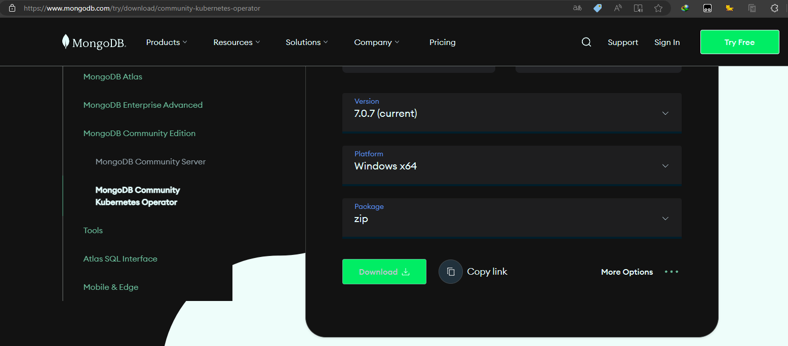
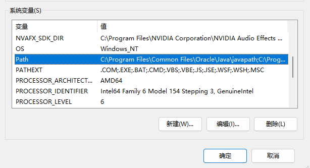
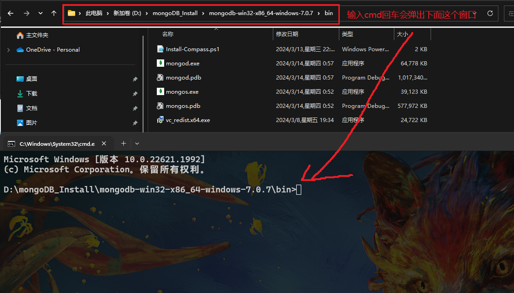
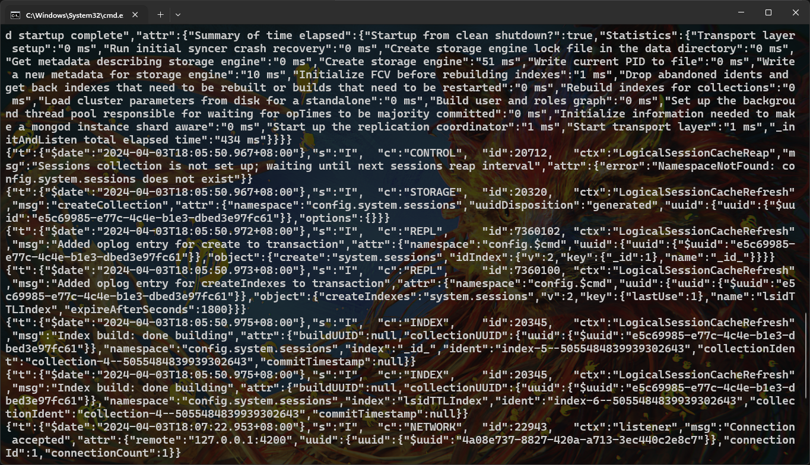
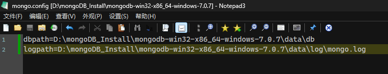
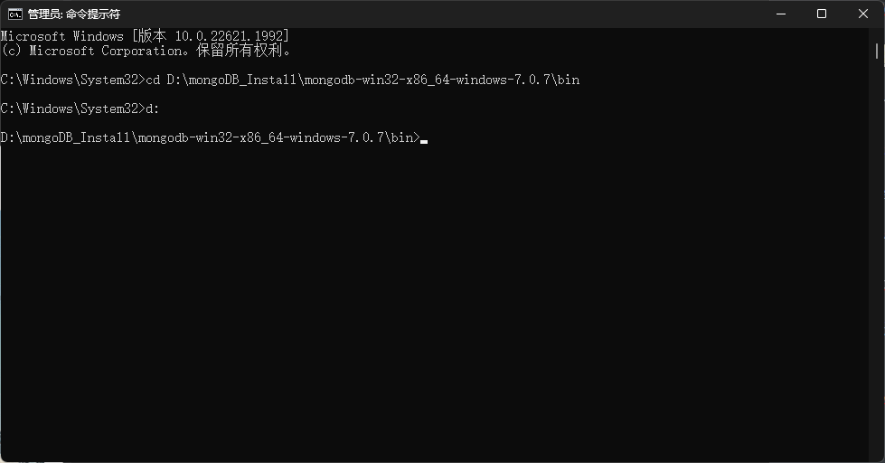
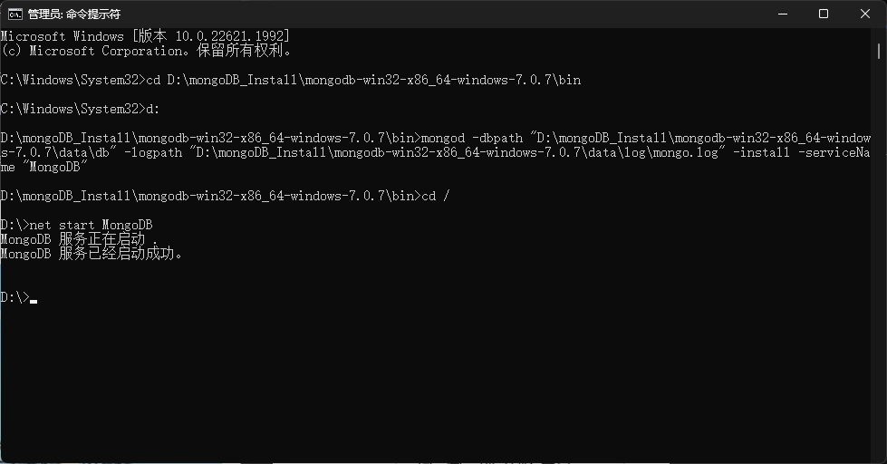
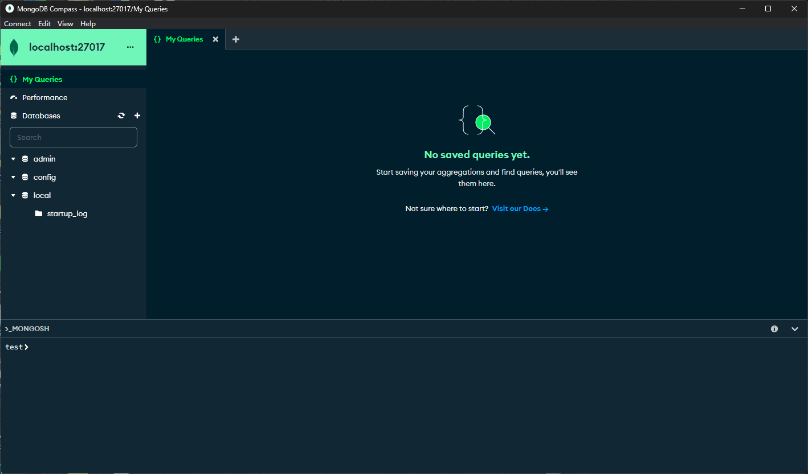
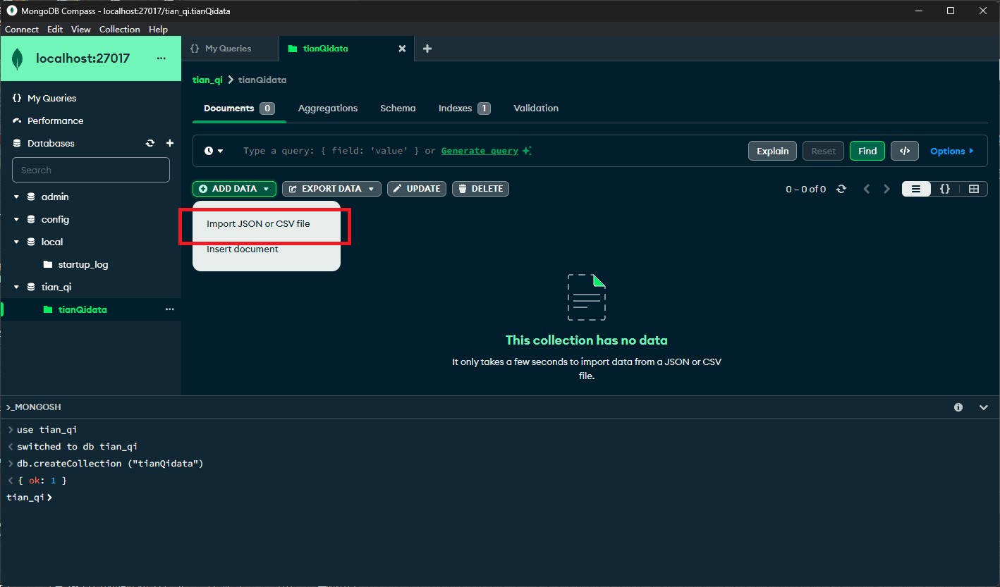
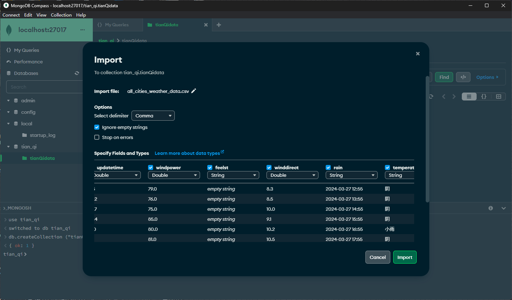

# mongo从安装到使用

## 下载安装

进入官网：[https://www.mongodb.com/try/download/community](https://www.mongodb.com/try/download/community) 选择版本和系统

怕麻烦的话选择安装包下载，我这里选择压缩包;



如果不想爆掉C盘就选择压缩包,也是我的个人习惯了,一把安装东西都是选择压缩包了;

解压后手动在根目录下创建**data和log**两个文件夹

配置环境变量，添加mongoDB的bin路径，比如我的就是：D:\mongoDB_Install\mongodb-win32-x86_64-windows-7.0.7\bin
我也是懒了,就没有改文件名,文件名一般来说改短一点的了;


在data目录里创建一个db文件夹

进入bin目录输入cmd



输入命令：
```shell
mongod --dbpath D:\mongoDB_Install\mongodb-win32-x86_64-windows-7.0.7\data\db
```

把D:\mongoDB_Install\mongodb-win32-x86_64-windows-7.0.7\data\db换成你的路径；

回车之后就会有很多东西：



之后打开浏览器输入：http://localhost:27017/

就会有这些东西：


这样安装就是成功了

在前面打开的cmd窗口 **CTRL+C**结束进程；

## 不需要进入bin目录启动mongo的篇日志方法：

在data目录下创建**log文件夹**；

在安装根目录即bin同级目录下创建文件：**mongo.config**

随便一个文本编辑器打开并添加内容：



其中D:\mongoDB_Install\mongodb-win32-x86_64-windows-7.0.7改为你的安装路径；

以管理员身份运行cmd并进入bin目录；


输入：
```shell
mongod -dbpath "D:\mongoDB_Install\mongodb-win32-x86_64-windows-7.0.7\data\db" -logpath "D:\mongoDB_Install\mongodb-win32-x86_64-windows-7.0.7\data\log\mongo.log" -install -serviceName "MongoDB"
```
其中"D:\mongoDB_Install\mongodb-win32-x86_64-windows-7.0.7\data\db"和

"D:\mongoDB_Install\mongodb-win32-x86_64-windows-7.0.7\data\log\mongo.log"为你的路径

"MongoDB"为服务名;

完了以后启动服务:net start MongoDB

关闭服务:net stop MongoDB


从任务管理器进入服务找到MongoDB(快键m),选择打开服后再次找到MongDB(快键m)或者直接**win + r** 输入 **services.msc**

编辑其属性中的启动类型为手动应用确定;

## **安装MongoDB Compass可视化工具**

网址:[MongoDB Compass Download (GUI) | MongoDB](https://www.mongodb.com/try/download/atlascli)

选择(stable)稳定版本,系统以及安装方式自选,我选择为windows10 64位(Zip)版解压即用;
嫌麻烦 选exe或者msi版本也可以;

解压或者安装完了后 ,最后打开连接就可以,我这里换了主题对眼睛好(我喜欢这个配色😍):


## csv数据导入

新建库:use 库名

新建集合:db.createCollection ("集合名")

导入csv数据





## 创建python项目操作mongoDB查询等
详见项目.py文件[README.md](./README.md)

## 学习并且使用chart.js库进行数据可视化

官方文档:[Chart.js | Open source HTML5 Charts for your website (chartjs.org)](https://www.chartjs.org/)

我将它下载到[项目文件js](./js/chart.js)中了,就是为了能够在学校机房无网的情况下能够使用它;

## 在web页打开实现可视化和查询操作

先说个有意思的事:我的博客站是用php+mysql构建的，在自定义页面的时候我就发现在html中竟然可以直接写php代码，然后我就在想，我用python写好各个需求的函数在填入html中怎样？结果一了解还真有这个库[PyScrip](https://pyscript.net/);

在html运行python似乎是个好主意,但是我在实践的过程中发现,不得了,效率巨慢😅

所以还是选择了花点时间学习下chart.js

遇到的一些问题在这里:[README](https://github.com/ShaogHong/-python-SQL/blob/6cc4364b3f1fa355f5d800297e247bf831b627b0/%E6%8C%96%E5%9D%91%E8%B8%A9%E5%9D%91%E5%A1%AB%E5%9D%91.md)

