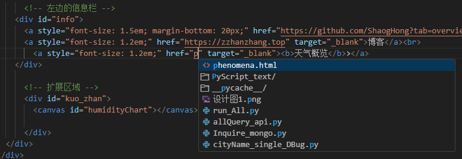

# 挖坑踩坑填坑
## 优化与重构

200行以上的py文件就不要给chatGPT优化了,不优化还能运行,
给它优化后:

它认为冗余的但是实际有用的代码删除了;

一些变量名它认为不符合命名规则也给你改了,然后给它优化其它文件时它又给了另外的命名;


## 代码中的问题
在天气概览中,我把可视化的图放到了另一个html中,但是访问的链接当时是这样的:

我就根据它的代码提示选择了它,实际是访问不了的,也不是访问不了,是返回不了数据;
正确的链接应该是这样的:http://localhost:63342/py_mongoDB_work/phenomena.html

图片：


```python
# 成功解决问题的关键!!!
#response = jsonify(data)
#response.headers.add('Access-Control-Allow-Origin', '*')  # 添加允许所有域名的头信息
```


第二api访问错误的问题：

图片

解决办法

```python
# from flask_cors import CORS
# app = Flask(__name__)
# CORS(app)
```
