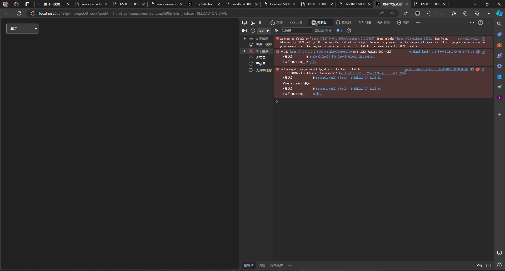

# 挖坑踩坑填坑
## 优化与重构

200行以上的py文件就不要给chatGPT优化了,不优化还能运行,
给它优化后:

它认为冗余的但是实际有用的代码删除了;

一些变量名它认为不符合命名规则也给你改了,然后给它优化其它文件时它又给了另外的命名;


## 代码中的问题
在天气概览中,我把可视化的图放到了另一个html中,但是访问的链接当时是这样的:

我就根据它的代码提示选择了它,实际是访问不了的,也不是访问不了,是返回不了数据;
正确的链接应该是这样的:http://localhost:63342/py_mongoDB_work/phenomena.html

## 第二api访问错误的问题：

在下拉列表中选中一个城市后,并没有返回对应的天气数据,浏览器控制台错误项为:


解决办法

```python
#在Flask应用中启用跨源资源共享（CORS）支持
from flask_cors import CORS
app = Flask(__name__)
CORS(app)
```

```python
response = jsonify(data)
response.headers.add('Access-Control-Allow-Origin', '*')  # 添加允许所有域名的头信息
```

## 一些浏览器插件也会导致奇奇怪怪的问题：
我的一个浏览器插件竟然把api返回的数据给拦截了，排查到这个问题的方法就是换了一个浏览器，在另一个浏览器（未装插件）中能够完美访问和返回数据，
解决方法当然就是把插件禁用了咯，当时排查这个错误的时候有点烦躁了，就忘记截图了；具体错误项也忘记了；